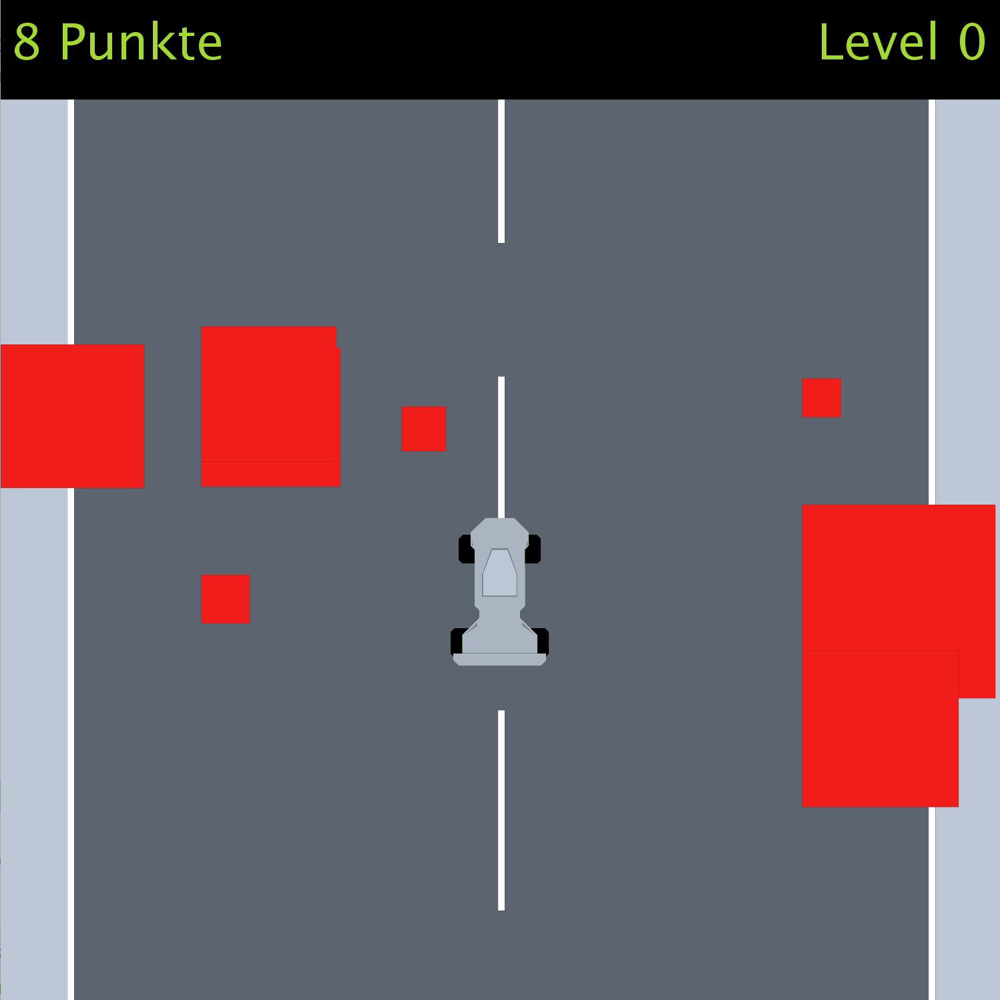

 Studienleistung 2: Rad Racer  
 
 
Changes again
Test for updating repo content again

[*   Wichtige Informationen](#WichtigeInformationen)[*   Bewertungskriterien](#Bewertungskriterien)[*   Zusammenfassung](#Zusammenfassung)[*   Screenshots](#Screenshots)[*   Anforderungen](#Anforderungen)[*   Hinweise und Hilfestellungen](#HinweiseUndHilfestellungen)

Studienleistung 2: Rad Racer
============================

Wichtige Informationen
======================

In dieser Studienleistung werden Sie ein Computerspiel implementieren. Um die Aufgabe zu bearbeiten, müssen Sie zuerst das Projekt [OOP-WS17-18-Studienleistung-2-Starter.zip](https://elearning.uni-regensburg.de/mod/resource/view.php?id=908053) in IntelliJ öffnen. Nutzen Sie zum Lösen der Aufgabenstellung die bereitgestellten Klassen und Dateien. Zum Einreichen Ihrer Aufgaben nutzen Sie die entsprechende Funktion in [GRIPS](https://elearning.uni-regensburg.de/mod/assign/view.php?id=907847). Falls Sie Probleme mit dem Starterpaket oder dem Einreichen der Aufgabe haben, können Sie sich in den [Handouts auf GRIPS](https://elearning.uni-regensburg.de/mod/resource/view.php?id=872263) informieren.

Bitte denken Sie daran, bei Nachfragen zur Studienleistung keinen Code im [GRIPS-Forum](https://elearning.uni-regensburg.de/mod/forum/view.php?id=872248) zu posten. Wenn Sie Ihre Frage nicht ohne Beispiel stellen können, schreiben Sie uns eine [Email](mailto:mi.oop@mailman.uni-regensburg.de).

AbgabeDie fertige Lösung dieser Aufgabe muss bis zum 17. Dezember, 23:55 Uhr über GRIPS eingereicht werden. Bitte beachten Sie: Erstellen Sie ein zip-Archiv (mit der korrekte Endung _\*.zip_) mit dem kompletten Projektordner. Überprüfen Sie vor dem Hochladen Ihrer Lösung, ob das von Ihnen erstellte Archiv funktioniert. Entpacke Sie dieses dazu an einen beliebigen Ort auf Ihrem Rechner und öffnen Sie das entpackte Projekt mit IntelliJ. Abgaben, die nicht im geforderten Format eingereicht werden oder nicht alle benötigten Dateien enthalten, werden bei der Korrektur nicht berücksichtigt und dementsprechend mit 5.0 bewertet. Sollten Sie technische Probleme beim Hochladen haben, wenden Sie sich bitte rechtzeitig per Mail oder Forum an uns.

AchtungEine Verlängerung der Abgabefrist ist nicht möglich. Einreichungen die uns zu spät oder per E-Mail erreichen, werden nicht berücksichtigt. Alle nicht eingereichten Aufgaben werden mit 5.0 bewertet. Testen Sie den Upload am besten schon vor Ablauf der Frist in Ruhe: Sie können bis zum Abgabetermin beliebig viele neue Lösungen einreichen. Denken Sie bitte auch daran, die bekannten [Regeln zu Plagiaten in der Medieninformatik](https://elearning.uni-regensburg.de/mod/resource/view.php?id=872253) zu beachten.

Bewertungskriterien
===================

Seien Sie kreativ! Wenn Sie möchten, können Sie Ihr Spiel gerne erweitern. Entwerfen Sie ein eigenes Design oder überlegen Sie sich neue Spielmechaniken. Die Grundidee ist auf viele Szenarien anwendbar, wie bspw. ein Raumschiff, das durch einen Asteroidengürtel fliegen muss.

Für die gesamte Studienleistung gilt, dass die eingereichten Lösungen nur die in der Aufgabenstellung beschriebenen Probleme lösen sollen. Lassen Sie keinen Teil der jeweiligen Aufgabe weg und interpretieren Sie die Fragestellung nicht selbstständig. Bewertet wird, inwieweit Sie das beschriebene Problem vollständig lösen. Wenn Sie die Aufgaben erfolgreich bearbeitet haben, können Sie Ihre Lösung gerne kreativ gestalten und erweitern; achten Sie dabei darauf, dass die eigentlichen Anforderungen weiterhin erfüllt bleiben.

Die Qualität Ihres Codes fließt in die Gesamtnote mit ein: Nutzen Sie das Decomposition-Pattern um Ihre Programme übersichtlich zu gestalten. Verwenden Sie sinnvolle Bezeichner für Variablen und Methoden und kommentieren Sie ausreichend. Beachten Sie dazu die Kriterien für guten und schlechten Code, die in der Vorlesung erwähnt wurden.

Zusammenfassung
===============

In dieser Aufgabe sollen Sie ein Geschicklichkeits-Spiel entwickeln. Nutzen Sie dazu die `GraphicsApp`\-Umgebung und die vorgegebene Programmstruktur. In dem Spiel sollen Spieler ein Auto zwischen mehreren Hindernissen hindurch manövrieren. Ziel ist es dabei, möglichst viele der Hindernisse zu überleben, bevor das Spiel endet. Das Spiel ist verloren, wenn das Auto gegen ein Hindernis fährt.

Alle wesentlichen Spielobjekte werden durch die bekannten Elemente der `GraphicsApp` dargestellt. Die Straße besteht aus einem Rechteck (`Rect`), die Seiten- und Mittellinien ebenfalls. Für die Darstellung der Spielfigur wird ein Bild genutzt. Die Hindernisse werden als Rechtecke dargestellt. Über die _WASD-Tasten_ hat der Spieler die Möglichkeit, das Auto in eine bestimmte Richtung zu steuern (d.h. 'W' - nach oben, 'S' - nach unten, 'A' - nach links, 'D' - nach rechts). Die Straße wird als fester Hintergrund auf den Bildschirm gezeichnet.

Um zu simulieren, dass das Auto fährt, werden die Elemente der Welt - die Hindernisse - mit konstanter Geschwindigkeit vom oberen Rand des Bildschirms zum unteren animiert. Diese Geschwindigkeit entspricht demnach der Geschwindigkeit des Autos. Dieses kann sich horizontal bewegen, um Hindernissen auszuweichen. Diese Hindernisse können noch leichter vermieden werden, wenn zudem eine vertikale Verschiebung des Autos auf der Spielfläche durch den Spieler möglich ist. Deswegen sind auch Tasten für "nach oben" und "nach unten" eingeplant.

Sie können die Farben und Positionen der Spielobjekte in diesen Screenshots als Anhaltspunkt für Ihr eigenes Spiel verwenden. Alternativ können Sie sich aber auch ein eigenes Design ausdenken.

Screenshots
===========

   

Anforderungen
=============

Um diese Aufgabe erfolgreich zu bestehen, müssen Sie eine Reihe von Anforderungen erfüllen. Diese werden im folgenden aufgeführt und erläutert. Bitte beachten Sie dabei: Die hier genannten _funktionalen_ Anforderungen stellen den Mindestumfang Ihrer Lösung dar, um die Aufgabe zu bestehen. Für eine gute bis sehr gute Bewertung müssen Sie zusätzliche Elemente implementieren und auch auf [qualitative Aspekte](#Bewertungskriterien) achten. An den entsprechenden Stellen sind daher sowohl die minimalen Anforderungen (bestehen) als auch die möglichen Erweiterungen für eine gute bis sehr gute Bewertung aufgeführt. Die Umsetzung einiger dieser Erweiterungen können Sie in diesem Gif anschauen:

### Design und Parameter

Wählen Sie geeignete Farben, Positionen, Dimensionen und Parameter für die verschiedenen Komponenten der Anwendung. Es werden hierbei keine Vorgaben gemacht. Wählen Sie Werte, die zum einen eine benutzerfreundliche Verwendung des Spiels erlauben und zum anderen eine ansprechende Gestaltung bewirken. Achte Sie besonders auf die Relationen und Farbkontraste zwischen den Objekten. Ihr Spiel sollte am Ende einen positiven und durchdachten Gesamteindruck machen.

Minimale Anforderungen Speichern Sie die Farben und Parameter, die Sie zur Platzierung und Gestaltung der Objekte benötigen, in geeigneten Konstanten ab. Damit Sie die Darstellung des Spiels leichter anpassen und optimieren können, sollten Sie innerhalb Ihrer Anwendung immer nur auf diese Konstanten zurückgreifen. Vermeiden Sie auf jeden Fall sogenannte _Magic Numbers_. Überlegen Sie sich, in welchen Klassen Sie die unterschiedlichen Konstanten am besten unterbringen können.

Mögliche Erweiterung Nutzen Sie eine zentrale Klasse zur Speicherung der Konfigurationswerte. Stellen Sie die dort gespeicherten Werte in den anderen Teilen Ihrer Anwendung dar. Dies können Sie erreichen, in dem Sie die Konstanten dort öffentlich zugänglich machen (`public`). Sind die Konstanten über das Schlüsselwort `static` auf Klassenebene angelegt, können Sie von überall - ohne Instanziierung - über den Namen der Konfigurations-Klasse auf die entsprechenden Werte zugreifen. Achten Sie darauf, keine veränderbaren Werte in der Konfigurations-Klasse zu speichern! Dies ist ein Merkmal für geringe Codequalität.

### Straße

Minimale Anforderungen Erstellen Sie eine Klasse `Road`, die Sie zur Darstellung der Straße verwenden. Die Straße besteht aus einem Rechteck für den Asphalt, zwei Rechtecken für die Seitenlinie und einem Rechteck für die Mittellinie. Die Klasse verfügt über eine öffentliche Methode `draw`, mit deren Aufruf der Boden auf dem Bildschirm gezeichnet wird.

Mögliche Erweiterung Implementieren Sie in der Klasse `Road` eine gestrichelte Mittellinie, die aus mehreren einzelnen Rechtecken besteht und sich mit der konstanten Geschwindigkeit des Spielfeldes mitbewegt. Hierzu ist es sinnvoll, eine öffentliche Methode `update` zu implementieren, in der die einzelnen Striche verschoben werden. Wenn ein Strich den unteren Rand des Bildschirms verlässt, muss dafür gesorgt werden, dass von oben wieder ein Strich nachkommt.

### Spielfigur

Implementieren Sie für die Repräsentation der Spielfigur eine Klasse `Player`. Diese soll alle Variablen und Methoden beinhalten, die zur Realisierung der gewünschten Funktionalitäten benötigt werden. Erstellen Sie in der Klasse öffentliche Methoden, über die die Spielfigur gesteuert werden kann, sowie Methoden, um die Figur zu aktualisieren und zu zeichnen.

*   `moveLeft`: Über den Aufruf dieser Methode wird eine Bewegung nach links ausgelöst.
*   `moveRight`: Über den Aufruf dieser Methode wird eine Bewegung nach rechts ausgelöst.
*   `moveUp`: Über den Aufruf dieser Methode wird eine Bewegung nach oben ausgelöst.
*   `moveDown`: Über den Aufruf dieser Methode wird eine Bewegung nach unten ausgelöst.
*   `draw`: Über den Aufruf dieser Methode wird die Spielfigur an ihrer aktuellen Position gezeichnet.
*   `update`: Über den Aufruf dieser Methode wird die Position der Spielfigur aktualisiert.

Minimale Anforderungen Die Spielfigur nutzt das bereitgestellte Bild 'car.png' für die Darstellung und _startet sich im unteren Drittel der Straße_. Drückt der Spieler einer der WASD-Tasten, bewegt sich die Figur um eine konstante Distanz in die entsprechende Richtung. Das Auto kann sich dabei nicht aus dem sichtbaren Spielbereich entfernen.

Mögliche Erweiterung Die Steuerung ist deutlich angenehmer, wenn sich das Auto bei Tastendruck nicht nur einmal kurz über eine festgelegte Entfernung bewegt, sondern über mehrere Frames hinweg in einer glatten Bewegung zur neuen Position gleitet. Hierzu ist es sinnvoll, einen Bewegungsimpuls zu implementieren, der pro Frame, also pro `draw`\-Aufruf, kleiner wird.

### Hindernisse

Die Hindernisse in Ihrem _Rad Racer_\-Spiel sind quadratische Blöcke, zwischen denen der Spieler hindurchfahren muss und werden durch eine neue `Obstacle`\-Klasse modelliert. Stellen Sie die Hindernisse als Instanzen der `Rect`\-Klasse dar. Die Hindernisse bewegen sich vom oberen zum unteren Bildschirmrand, um das Fahren des Autos zu simulieren. Initial wird jedes Hindernis außerhalb des sichtbaren Bildschirms platziert und erscheint erst durch die kontinuierliche Veränderung der y-Position. Sobald das aktuell sichtbare Hindernis aus dem unteren Bildschirmrand hinaus bewegt wurde, wird ein neues Hindernis generiert. Dieses wird dann erneut über dem oberen Bildschirmrand platziert und bewegt sich dann von dort nach unten. Erstellen Sie für die beschrieben Funktionaliät eine Klasse `Level`. Die Klasse verwaltet die Hindernisse - im Konstruktor werden horizontal zufällig platzierte `Obstacles` mit zufälliger Größe erzeugt. In den öffentlichen Methoden wird die Aktualisierung und das Zeichnen angestoßen:

*   `update`: Mit dem Aufruf werden die Hindernisse um einen festen Wert nach unten verschoben und es wird der Fall behandelt, dass Hindernisse vom Bildschirm verschwinden.
*   `draw`: Mit dem Aufruf dieser Methode werden alle Hindernisse gezeichnet.
*   `handleCollisions(Collidable collidable)`: Diese Methode bekommt ein `Collidable` übergeben, welches den Spieler repräsentiert und überprüft, ob der Spieler mit einem Hindernis zusammengestoßen ist. Mehr zu `Collidable`s folgt in der Teilaufgabe zur Kollisionsdetektion.

Minimale Anforderungen Es wird eine feste Anzahl an Hindernissen dargestellt, deren Größe und Position zufällig ist. In der `Level`\-Klasse legen Sie dazu geeignete Konstanten für eine minimale und maximale Blockgröße fest. Alle Hindernisse bewegen sich mit der selben Geschwindigkeit über den Bildschirm.

Mögliche Erweiterung Zählen Sie die überwundenen Hindernisse und blenden Sie die entsprechende Zahl auf dem Bildschirm ein.  
Implementieren Sie einen Levelmechanismus, in dem Sie die Geschwindigkeit und/oder die Anzahl oder Größe der Hindernisse mit zunehmender Spielzeit anpassen. Dadurch können Sie die Schwierigkeit und damit die Motivation für den Spieler bewusst gestalten.

Mögliche Erweiterung Durch die zufällige Platzierung der Hindernisse kann es vorkommen, dass unmöglich zu schaffende Situationen auftreten. Hier gibt es mehrere Wege, Abhilfe zu schaffen - einer davon ist, einen Spaltenmechanismus für die Hindernisse zu implementieren. Geht man davon aus, dass das Spielfeld in bspw. 5 Spalten unterteilt wird, kann für jedes neu erstellte Hindernis eine davon zufällig gewählt werden. Um dem Spieler einen Ausweg zu lassen, kann man für eine bestimmte Anzahl von `update`\-Aufrufen eine der Spalten von neuen Hindernissen frei halten.

### Kollisionsabfrage

Sorgen Sie dafür, dass korrekt erkannt wird, wenn die Spielfigur gegen ein Hindernis fährt. Dabei gilt folgende Spezifikation: Die Spielfigur prallt gegen ein Hindernis, sobald sich ihre x-Position und y-Position mit der Position eines der Hindernis-Rechtecke überschneidet. Sorgen Sie dafür, dass dieser Fall überprüft und korrekt verarbeitet wird. Bedenken Sie, dass Sie bei der Abfrage auch die Breite der Hindernisse und der Spielfigur berücksichtigen müssen. Es lohnt sich, die `Obstacle`\- und die `Player`\-Klassen das `Collidable`\-Interface implementieren zu lassen. So kann über die bereitgestellten, vorgegebenen Methoden die Kollision erkannt werden. Sie dürfen das `Collidable`\-Interface auch sinnvoll, d.h. im engen Rahmen des Einsatzzwecks, erweitern. Fügen Sie keine Funktionen hinzu, die nichts mit der Kollisionsdetektion zu tun haben.

### Kommunikation innerhalb der Anwendung

Im Laufe des Spiels können zwei besondere Ereignisse auftreten, die in der `Level`\-Klasse erkannt werden und möglicherweise an anderen Stellen Ihres Programms relevant sind. Diese Ereignisse sind das erfolgreiche Überwinden eines Hindernisses und das Anstoßen des Spielers an einem Hindernis. Sie müssen diese Information innerhalb Ihrer Anwendung kommunizieren und haben dazu zwei Möglichkeiten.

Minimale Anforderungen Erstellen Sie entsprechende, öffentliche Methoden in der `Level`\-Klasse und fragen Sie in der Hauptklasse Ihres Spiels (`GameManager`) regelmäßig ab, ob eines der Ereignisse eingetroffen ist. Reagieren Sie dann entsprechend darauf.

Mögliche Erweiterung Implementieren Sie an geeigneter Stelle das vorgegebene Interface `GameEventListener` und nutzen Sie dieses zur Realisierung eines _Observer/Listener_\-Mechanismus mit dem Sie die Ereignisse (_Events_) aus dem `Level` heraus kommunizieren können. Dazu müssen Sie eine Instanz eines `GameEventListeners` an `Level` übergeben, wenn Sie dieses instanziieren. Falls in Ihrer Version des Spiels weitere Spiel-Eregnisse eintreten, können Sie das GameEventListener-Interface entsprechend erweitern.

### Spielende

Das Spiel endet, wenn das Auto gegen eines der Hindernisse fährt. Die Bewegung der Spielfigur und der Hindernisse wird in diesem Fall angehalten. Auf dem Bildschirm wird der letzte Zustand des Spiels angezeigt. Alternativ können Sie aber auch eine kreative Reaktion der Spielfigur realisieren. Darüber hinaus gelten folgende Anforderungen:

Minimale Anforderungen Blenden Sie in der Mitte des Bildschirms den Text "Game Over" ein.

Mögliche Erweiterung Ermöglichen Sie es, das Spiel vom _Game Over_\-Screen aus neu zu starten. Sie können dazu z.B. eine Taste verwenden und den Spieler durch einen eingeblendeten Text zum Neustart des Spiels auffordern.

Hinweise und Hilfestellungen
============================

Während der Arbeit an der Studienleistung können Sie sich jederzeit per Mail oder über das GRIPS-Forum an uns wenden. Zögern Sie bitte nicht, bei Probleme oder Unklarheiten zu fragen.

#### Allgemeines Vorgehen

AchtungLesen Sie die Aufgabenstellung sorgfältig durch. Sollten Sie Teile der Anforderungen nicht verstehen, melden Sie sich rechtzeitig per Mail oder im Forum. Planen Sie ausreichend Zeit für die Bearbeitung der Aufgabe ein und beginnen Sie dementsprechend rechtzeitig mit der Implementierung Ihrer Lösung.

Bearbeiten Sie alle Teile der Anwendung losgelöst voneinander und in einer logischen Reihenfolge. Beginnen Sie mit den einfachen Bestandteilen des Spiels. Erweitern Sie dabei kontinuierlich den Rahmen Ihrer Anwendung in der zentralen Klasse `GameManager`, welchen Sie in der Anwendungsklasse `RadRacer` instanziieren und aktualisieren. Testen Sie die neu hinzugekommenen Bestandteile, indem Sie Instanzen der entsprechenden Klassen erzeugen und deren Funktionen in den _draw loop_ der Anwendung integrieren.

1.  Implementieren Sie zuerst die Klasse `Road` um den Boden der Spielwelt darzustellen.
2.  Ergänzen Sie anschließend die Spielfigur durch Implementierung der `Player`\-Klasse.
3.  Zuletzt wird das `Level` implementiert.
4.  Kombinieren Sie die Funktionaliäten der so entstandenen Klassen sinnvoll in der Hauptklasse Ihrer Anwendung.

#### Sounds in der GraphicsApp

Die Klasse `Sound` der `GraphicsApp`\-Umgebung erlaubt das Abspielen von Audiodateien. Diese Dateien müssen im _wav_\-Format vorliegen und im _Package_ `data.assets` des `src`\-Ordners gespeichert sein. Übergeben Sie den korrekten Pfad zur gewünschten Audiodatei an den Konstruktor der Klasse. Auf dem instanziierten Objekt können Sie verschieden Methoden zur Steuerung der Audioausgabe aufrufen. Weitere Informationen dazu finden Sie auch in der [Dokumentation](https://elearning.uni-regensburg.de/mod/url/view.php?id=872257).

                `private static final Sound JUMP_SOUND = new Sound("/data/assets/jump.wav");
                JUMP_SOUND.play();` 
                

#### Labels in der GraphicsApp

Um `Labels` abhängig von Konstanten zu platzieren, ist häufig das Abfragen der Breite eines `Labels` notwendig. Die Methode `getWidth` funktioniert leider nicht korrekt. Sie können zur groben Berechnug der Breite folgende Daumenregel nutzen:

    
                    (Länge des Textes)*Fontgröße/2 

Stand: 1. Dezember 2017. Die Aufgabenstellung wurde von Alexander Bazo und Florin Schwappach verfasst. Dieser Text stellt die gültigen Anforderungen für die zweite Studienleistung im Kurs _Einführung in die objektorientierte Programmierung mit Java_ dar.
